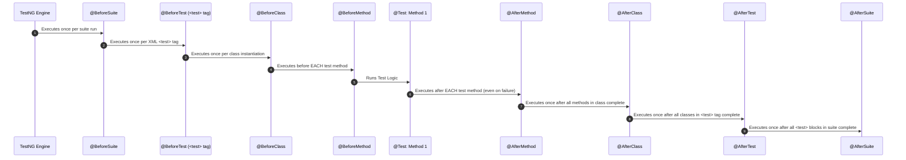

# SECTION 17 — TESTNG ARCHITECTURE & AUTOMATION FRAMEWORK DESIGN (Senior SDET Masterclass)

## Topics Covered
- **17.1 TestNG Architecture & Lifecycle Execution Flow** (Suite -> Test -> Class -> Method Hierarchy, DAG Topological Sort)
- **17.2 Annotation Hierarchy & Execution Order** (`@BeforeSuite` through `@AfterSuite`, Inheritance Rules, Group Lifecycle)
- **17.3 Method Parameters & Test Isolation** (`@Test` attributes, Priority vs Dependency, Blast Radius of Chained Tests)
- **17.4 Parallel Execution Mechanics** (`parallel="methods"|"classes"|"tests"`, Thread Pool Tuning, Worker Allocation)
- **17.5 Data Providers & Data-Driven Testing** (`@DataProvider(parallel = true)`, Dynamic Injection, Thread Safety)
- **17.6 TestNG Listeners Architecture** (`ITestListener`, `ISuiteListener`, `IInvokedMethodListener`, `IAnnotationTransformer`, `IRetryAnalyzer`)
- **17.7 Assertions Engine** (Hard Assert vs. Thread-Bound `SoftAssert`, Clean Lifecycle & Reporting Traps)
- **17.8 Dynamic Test Retries Without XML Edits** (`IAnnotationTransformer` + `IRetryAnalyzer`, De-duplicating CI Reports)
- **17.9 Thread Safety in TestNG Listeners** (Eliminating Static Contamination in Extent/Allure Reporting, `ThreadLocal` Sanitation)
- **17.10 XML Suite Architecture** (Master Suites, Groups, Regex Matching, Surefire Binding, Parameter Precedence)
- **17.11 High-Stakes Senior TestNG Interview Questions & Spoken Solutions** (Verbatim Staff-Level Battle-Tested Answers)

---

## 17.1 TestNG Architecture & Lifecycle Execution Flow

TestNG (*Test Next Generation*) is not merely a test runner; it is a structured, graph-driven execution engine designed explicitly for complex integration, end-to-end (E2E), and concurrent test orchestration.

### Architectural Hierarchy
TestNG structures execution into a strict 4-tier hierarchical domain model:

```
┌────────────────────────────────────────────────────────────────────────┐
│                        SUITE (<suite> / ISuite)                         │
│  Top-level container. Configures global listeners, parameters, & pools │
│  ┌──────────────────────────────────────────────────────────────────┐  │
│  │                     TEST (<test> / XmlTest)                      │  │
│  │  Logical partition. Defines target browser, env, packages/classes│  │
│  │  ┌────────────────────────────────────────────────────────────┐  │  │
│  │  │                   CLASS (<class> / XmlClass)               │  │  │
│  │  │  Java class holding test implementations and fixture hooks │  │  │
│  │  │  ┌──────────────────────────────────────────────────────┐  │  │  │
│  │  │  │            METHOD (<include> / ITestNGMethod)        │  │  │  │
│  │  │  │  Individual executable test unit marked with @Test   │  │  │  │
│  │  │  └──────────────────────────────────────────────────────┘  │  │  │
│  │  └────────────────────────────────────────────────────────────┘  │  │
│  └──────────────────────────────────────────────────────────────────┘  │
└────────────────────────────────────────────────────────────────────────┘
```

### The Internal Execution Engine & Graph Resolution
When TestNG starts (either through Maven Surefire, CLI, or programmatic runner `TestNG.class`):
1. **XML Parsing & Object Model Hydration**: TestNG parses `testng.xml` into memory via `Parser.parse()`, hydrating `XmlSuite`, `XmlTest`, `XmlClass`, and `XmlInclude` domain models.
2. **Listener & Transformer Bootstrapping**: `ServiceLoader`, XML listeners, and CLI parameters register interceptors. Any registered `IAnnotationTransformer` modifies method annotations *before* the execution graph is compiled.
3. **DAG (Directed Acyclic Graph) Topological Sorting**:
   - TestNG constructs an execution graph using a Directed Acyclic Graph (DAG) for all test methods within an `<test>` boundary.
   - Nodes represent `ITestNGMethod` instances; directed edges represent dependency constraints (`dependsOnMethods`, `dependsOnGroups`).
   - If circular dependencies exist ($A \rightarrow B \rightarrow A$), TestNG detects the cycle during topological traversal and throws `org.testng.TestNGException: Cyclic dependency found`.
   - Priority integers (`priority = n`) are applied as secondary sorting weights *only within independent nodes* of identical dependency rank.
4. **Task Scheduling & Worker Dispatch**:
   - `SuiteRunner` processes each `<test>` block, creating a `TestRunner`.
   - `TestRunner` dispatches execution units to a dedicated `ThreadPoolExecutor` or runs them sequentially based on `parallel` settings.

```
       testng.xml / Dynamic Suite
                  │
                  ▼
         [ TestNG Parser ]
                  │
                  ▼
    [ IAnnotationTransformer ]  ◄── Mutates @Test, @DataProvider metadata
                  │
                  ▼
     [ DAG Dependency Graph ]   ◄── Topologically sorts nodes, resolves dependsOn
                  │
                  ▼
          [ SuiteRunner ]       ◄── Fires ISuiteListener.onStart()
                  │
                  ▼
          [ TestRunner ]        ◄── Fires ITestListener.onStart()
                  │
         ┌────────┴────────┐
         ▼                 ▼
   Worker Thread 1    Worker Thread 2  ◄── Managed by internal ThreadPoolExecutor
   [@BeforeMethod]    [@BeforeMethod]
   [@Test Method ]    [@Test Method ]
   [@AfterMethod ]    [@AfterMethod ]
```

---

## 17.2 Annotation Hierarchy & Execution Order

Understanding the precise execution sequence across configuration hooks is paramount. Confusing `<test>` (the XML partition) with `@Test` (the Java method) is the single most common junior architectural mistake.

### Complete Lifecycle Sequence Diagram



### Hierarchy Execution Rules & Scope

| Annotation | Execution Frequency | Primary SDET Use Case | Thread Safety Requirement |
| :--- | :--- | :--- | :--- |
| `@BeforeSuite` | Once per entire suite run | Global reporting setup (Extent/Allure initialization), Docker container spin-up (Testcontainers), Global DB schema validation. | Run on Main Thread before any worker thread spawns. |
| `@BeforeTest` | Once per XML `<test>` block | Environment configuration, browser binary verification, context-level parameter parsing. | Executed sequentially per `<test>` block unless `parallel="tests"`. |
| `@BeforeClass` | Once per Java class | Shared non-volatile class resources, base URL resolution, API client initialization (if stateless). | Must be thread-safe if `parallel="methods"` is enabled. |
| `@BeforeMethod`| Once before **every** `@Test` | **Driver provisioning** (`ThreadLocal<WebDriver>`), clean session creation, fresh test-data binding. | **Critical**: Must bind driver to current thread. |
| `@AfterMethod` | Once after **every** `@Test` | **Driver teardown** (`driver.quit()`), failure screenshot capture, `ThreadLocal.remove()`. | **Must use `alwaysRun = true`** to avoid zombie processes. |
| `@AfterClass`  | Once after all methods in class | Class-level connection pool termination, file handle cleanup. | Must use `alwaysRun = true`. |
| `@AfterTest`   | Once after all classes in `<test>`| Tear down `<test>` scoped resources (e.g., local mock servers). | Must use `alwaysRun = true`. |
| `@AfterSuite`  | Once per entire suite run | Flush reports (`extent.flush()`), upload artifacts to S3, teardown Selenium Grid/Docker Compose. | Executed after all worker threads terminate. |

### Superclass vs. Subclass Inheritance Resolution
When test classes extend a `BaseTest`:
- **`@Before*` hooks**: TestNG executes the **Superclass** `@Before` methods **first**, cascading down to the Subclass `@Before` methods.
- **`@After*` hooks**: TestNG executes the **Subclass** `@After` methods **first**, cascading up to the Superclass `@After` methods (LIFO order).

> [!WARNING]
> If a `@BeforeMethod` fails in a superclass, TestNG marks the corresponding `@Test` method as **SKIPPED** and does not execute the subclass `@BeforeMethod`. However, if `@AfterMethod(alwaysRun = true)` is present, it will still execute, preventing resource leaks.

---

## 17.3 Method Parameters & Test Isolation

### Key Attributes of the `@Test` Annotation

```java
@Test(
    priority = 1,
    dependsOnMethods = {"com.enterprise.auth.LoginTest.testValidAuthentication"},
    dependsOnGroups = {"smoke.*"},
    enabled = true,
    timeOut = 15000,
    invocationCount = 10,
    threadPoolSize = 3,
    invocationTimeOut = 45000,
    expectedExceptions = {NoSuchElementException.class, TimeoutException.class},
    expectedExceptionsMessageRegExp = ".*element not visible.*",
    dataProvider = "checkoutData",
    dataProviderClass = CheckoutDataProvider.class,
    description = "Validates high-volume checkout workflow under simulated latency"
)
public void testCheckoutPerformance(OrderPayload payload) {
    // Test logic
}
```

### Deep Dive: Priority vs. `dependsOnMethods`

| Dimension | `priority = n` | `dependsOnMethods = {"methodName"}` |
| :--- | :--- | :--- |
| **Execution Guarantee** | Advises TestNG of preferred ordering (lower value runs first; negatives allowed). | Enforces an **explicit DAG edge**. Dependent method cannot run until target completes. |
| **Upstream Failure Behavior** | If priority 1 fails, priority 2 **still executes**. | If target method fails, dependent method is **instantly SKIPPED**. |
| **Parallel Suitability** | Safe in `parallel="methods"`, but does **not** guarantee sequence if worker threads are free. | **Severely impairs concurrency**. Thread scheduler must stall dependent tasks. |
| **Blast Radius** | Low. Tests remain functionally independent. | High. One upstream failure can cascade into skipping 50 downstream tests. |

### The Critical Anti-Pattern: Method Chaining
```
ANTI-PATTERN:
testLogin() ──(dependsOn)──► testAddToCart() ──(dependsOn)──► testCheckout()
```
**Why this breaks enterprise pipelines (5,000+ tests):**
1. **Parallel Execution Destruction**: TestNG cannot distribute `testCheckout()` to an idle worker thread while waiting for `testAddToCart()` to finish on another thread.
2. **False Flakiness Masking**: If `testLogin()` has a transient 500ms network timeout, `testAddToCart()` and `testCheckout()` are marked SKIPPED. The triage team cannot determine if the checkout engine is broken.
3. **Idempotency Violation**: Tests must be hermetic and atomic. 
   - **Remediation**: Use API calls or direct DB seeding inside `@BeforeMethod` to hydrate state (e.g., generate an authenticated bearer token and inject a cart item via REST API), making `testCheckout()` completely independent.

---

## 17.4 Parallel Execution Mechanics

TestNG provides granular concurrency control via the `parallel` attribute in `testng.xml`. Misconfiguring this attribute is the primary cause of driver collisions and race conditions.

```xml
<suite name="EnterpriseAutomationSuite" parallel="methods" thread-count="8" data-provider-thread-count="4">
```

### Concurrency Modes Explained

```
parallel="methods"
  Worker Pool [8 Threads]
  ├── Thread 1: TestClassA.testMethod1()
  ├── Thread 2: TestClassA.testMethod2()  ◄── Concurrent methods of SAME class
  └── Thread 3: TestClassB.testMethod1()

parallel="classes"
  Worker Pool [8 Threads]
  ├── Thread 1: TestClassA.testMethod1() ──► TestClassA.testMethod2() (Sequential)
  └── Thread 2: TestClassB.testMethod1() ──► TestClassB.testMethod2() (Sequential)

parallel="tests"
  Worker Pool [8 Threads]
  ├── Thread 1: <test name="ChromeTests"> (All classes inside run sequentially)
  └── Thread 2: <test name="FirefoxTests"> (All classes inside run sequentially)
```

### Comparative Analysis of Parallel Modes

| Mode | Concurrency Granularity | Ideal Enterprise Scenario | Thread Isolation Pitfalls |
| :--- | :--- | :--- | :--- |
| `parallel="methods"` | Highest. Every single method is scheduled onto an available worker thread. | 100% stateless API tests or UI tests using strictly confined `ThreadLocal<WebDriver>`. | Class-level variables (`private WebDriver driver;`) will collide instantly. |
| `parallel="classes"` | Medium. Class instances are distributed to threads; methods within a class run sequentially. | Stateful E2E UI flows where methods inside a class rely on shared state (e.g., step-by-step onboarding). | Slower test cycle if class sizes are heavily skewed. |
| `parallel="tests"` | Low. Dispatches entire `<test>` blocks across threads. | Cross-browser testing (e.g., running identical suites on Chrome, Firefox, Safari simultaneously). | Low hardware utilization if there are few `<test>` tags. |
| `parallel="instances"` | Medium-High. Test instances generated by `@Factory` run in parallel. | Parameterized class runs testing multi-tenant environments. | Memory leaks if factories create thousands of live instances. |

### Thread Pool Tuning Formula
For a dedicated test execution node (CI runner / VM):
$$\text{Optimal Thread Count} = \min\left(\text{Available CPU Cores} \times 2, \quad \frac{\text{Available RAM (MB)} - \text{OS Reserved (2048 MB)}}{\text{Per-Browser Footprint (e.g., 800 MB)}}\right)$$

> [!IMPORTANT]
> When UI tests execute via `parallel="methods"`, memory usage spikes rapidly. Chrome instances consume ~500MB to 1.2GB RAM each. Running `thread-count="16"` on an 8GB RAM CI runner will trigger OS-level Out-Of-Memory (OOM) killer terminations, crashing the entire JVM.

---

## 17.5 Data Providers & Data-Driven Testing

TestNG's `@DataProvider` provides programmatic data injection. It returns either a two-dimensional array (`Object[][]`) or an iterator of object arrays (`Iterator<Object[]>`).

### Memory Efficiency: `Iterator<Object[]>` vs. `Object[][]`
For small datasets (10-50 rows), `Object[][]` is acceptable. For enterprise scale (1,000+ rows from database queries or massive CSV/Excel sheets), returning `Object[][]` loads the entire dataset into heap memory upfront. Returning `Iterator<Object[]>` allows lazy loading, processing records one row at a time and drastically reducing GC pressure.

### Parallel Data Providers & Thread Isolation
By default, `@DataProvider` runs sequentially on the thread of the caller test. Setting `parallel = true` forces TestNG to run each row concurrently.

```java
package com.enterprise.automation.dataproviders;

import org.testng.annotations.DataProvider;
import java.lang.reflect.Method;
import java.util.Iterator;
import java.util.List;

public class UserDataProvider {

    @DataProvider(name = "userCredentialsProvider", parallel = true)
    public static Iterator<Object[]> supplyUserCredentials(Method testMethod) {
        // Method injection allows dynamic data slicing based on test method name or annotations
        String testName = testMethod.getName();
        
        List<Object[]> dataRows;
        if (testName.contains("Admin")) {
            dataRows = List.of(
                new Object[]{"admin_user_01@corp.internal", "Pass@123", "ADMIN_ROLE"},
                new Object[]{"admin_user_02@corp.internal", "Pass@456", "SUPER_ADMIN"}
            );
        } else {
            dataRows = List.of(
                new Object[]{"standard_user_01@corp.internal", "Pass@789", "CUSTOMER"},
                new Object[]{"standard_user_02@corp.internal", "Pass@012", "CUSTOMER"}
            );
        }
        return dataRows.iterator();
    }
}
```

```xml
<!-- Controlling DataProvider parallel concurrency in testng.xml -->
<suite name="DataDrivenSuite" data-provider-thread-count="5">
    <test name="ParallelDataTests">
        <classes>
            <class name="com.enterprise.automation.tests.UserAuthenticationTest"/>
        </classes>
    </test>
</suite>
```

> [!CAUTION]
> If a data provider passes mutable objects (e.g., custom POJOs or Maps) to parallel tests, concurrent threads mutating fields on that object will cause severe race conditions. Always pass immutable data records (`record` in Java 17+) or create deep copies per invocation.

---

## 17.6 TestNG Listeners Architecture

Listeners implement the Gang of Four (GoF) Observer pattern, decoupling test logic from infrastructure concerns like reporting, logging, environment setup, and dynamic retries.

### Listener Interfaces Summary

```
                      ┌──────────────────────┐
                      │    ITestNGListener   │
                      └──────────┬───────────┘
         ┌───────────────────────┼────────────────────────┐
         │                       │                        │
         ▼                       ▼                        ▼
  ┌──────────────┐       ┌──────────────┐       ┌────────────────────┐
  │ ITestListener│       │ISuiteListener│       │IInvokedMethodListen│
  └──────────────┘       └──────────────┘       └────────────────────┘
  Method success,        Suite start/finish     Intercepts EVERY call
  failure, skips         reporting flush        (inc. @Before/@After)
         │                       │                        │
         ▼                       ▼                        ▼
┌──────────────────┐   ┌──────────────────┐   ┌──────────────────────┐
│  IRetryAnalyzer  │   │IAnnotationTransf.│   │      IReporter       │
└──────────────────┘   └──────────────────┘   └──────────────────────┘
Evaluates failed       Mutates @Test metadata Generates post-run
test retry eligibility at bytecode parse-time XML/HTML summaries
```

### The 4 Registration Mechanisms

1. **`testng.xml` Registration (Recommended for CI pipelines)**:
   ```xml
   <suite name="EnterpriseSuite">
       <listeners>
           <listener class-name="com.enterprise.automation.listeners.TestExecutionListener"/>
           <listener class-name="com.enterprise.automation.listeners.RetryAnnotationTransformer"/>
       </listeners>
       <!-- tests -->
   </suite>
   ```
2. **Class-Level Annotation (`@Listeners`)**:
   ```java
   @Listeners({TestExecutionListener.class})
   public class BaseTest { ... }
   ```
   *Limitation*: Cannot register `IAnnotationTransformer` via `@Listeners` because transformers must execute *before* the class annotations are read!
3. **Java SPI (`ServiceLoader`)**:
   Create file: `src/test/resources/META-INF/services/org.testng.ITestNGListener` containing:
   `com.enterprise.automation.listeners.TestExecutionListener`
   *Advantage*: Transparently loaded across all test executions without XML or Java changes.
4. **Maven Surefire Plugin Arguments**:
   ```xml
   <properties>
       <property>
           <name>listener</name>
           <value>com.enterprise.automation.listeners.TestExecutionListener</value>
       </property>
   </properties>
   ```

---

## 17.7 Assertions (Hard Assert vs. SoftAssert)

### Internal Mechanics
- **Hard Assert (`Assert`)**: Throws an unhandled `java.lang.AssertionError`. The current method halts immediately. TestNG catches this error via reflection invocation and marks the method status as `FAILED`.
- **Soft Assert (`SoftAssert`)**: Traps assertion failures inside an internal `Map<AssertionError, IAssert<?>>`. The method continues executing subsequent lines. Upon invoking `.assertAll()`, it iterates through recorded errors, formatting an aggregate failure summary and throwing an `AssertionError` if one or more checks failed.

### The Catastrophic Static / Shared SoftAssert Bug
```java
// SEVERE BUG: Shared SoftAssert instance
public class AccountPageTest {
    private static final SoftAssert softAssert = new SoftAssert(); // OR class-level instance

    @Test
    public void testProfileHeader() {
        softAssert.assertEquals("ActualTitle", "ExpectedTitle"); // Passes
        softAssert.assertEquals("Active", "Inactive");          // FAILS (Recorded)
        softAssert.assertAll();                                 // Throws AssertionError
    }

    @Test
    public void testProfileFooter() {
        softAssert.assertEquals("Copyright 2026", "Copyright 2026"); // Passes
        // BUT softAssert STILL CONTAINS the failure from testProfileHeader!
        softAssert.assertAll(); // THROWS ASSERTION ERROR! testProfileFooter fails erroneously!
    }
}
```

### Production Thread-Safe SoftAssert Pattern
```java
package com.enterprise.automation.assertions;

import org.testng.asserts.SoftAssert;

public final class ThreadSafeSoftAssert {

    private static final ThreadLocal<SoftAssert> THREAD_LOCAL_SOFT_ASSERT = 
            ThreadLocal.withInitial(SoftAssert::new);

    private ThreadSafeSoftAssert() {}

    public static SoftAssert get() {
        return THREAD_LOCAL_SOFT_ASSERT.get();
    }

    public static void assertAll() {
        try {
            THREAD_LOCAL_SOFT_ASSERT.get().assertAll();
        } finally {
            // Clean up to avoid cross-test contamination in thread pools
            THREAD_LOCAL_SOFT_ASSERT.remove();
        }
    }

    public static void clean() {
        THREAD_LOCAL_SOFT_ASSERT.remove();
    }
}
```

---

## 17.8 Dynamic Test Retries Without XML Edits

Manually annotating thousands of tests with `@Test(retryAnalyzer = RetryAnalyzer.class)` violates DRY principles and creates high maintenance overhead. The enterprise solution combines `IAnnotationTransformer` and `IRetryAnalyzer`.

### Production-Grade `IRetryAnalyzer` Implementation
```java
package com.enterprise.automation.retry;

import org.openqa.selenium.NoSuchSessionException;
import org.openqa.selenium.StaleElementReferenceException;
import org.openqa.selenium.TimeoutException;
import org.testng.IRetryAnalyzer;
import org.testng.ITestResult;
import org.slf4j.Logger;
import org.slf4j.LoggerFactory;

public class DynamicRetryAnalyzer implements IRetryAnalyzer {

    private static final Logger log = LoggerFactory.getLogger(DynamicRetryAnalyzer.class);
    private static final int MAX_RETRY_COUNT = 2; // Maximum retry attempts
    private int retryCount = 0;

    @Override
    public boolean retry(ITestResult result) {
        Throwable throwable = result.getThrowable();

        // Guard against retrying deterministic business assertion errors
        if (throwable instanceof AssertionError) {
            log.warn("Test [{}] failed due to deterministic AssertionError. Retry aborted.", 
                     result.getName());
            return false;
        }

        // Only retry transient infrastructural or synchronization anomalies
        if (isTransientException(throwable) && retryCount < MAX_RETRY_COUNT) {
            retryCount++;
            log.warn("Retrying test [{}] with parameter set {} - Attempt [{}/{}] due to: {}",
                    result.getName(),
                    result.getParameters(),
                    retryCount,
                    MAX_RETRY_COUNT,
                    throwable != null ? throwable.getClass().getSimpleName() : "Unknown");
            return true;
        }

        return false;
    }

    private boolean isTransientException(Throwable throwable) {
        if (throwable == null) return false;
        return throwable instanceof TimeoutException
            || throwable instanceof StaleElementReferenceException
            || throwable instanceof NoSuchSessionException;
    }
}
```

### Production-Grade `IAnnotationTransformer`
```java
package com.enterprise.automation.retry;

import org.testng.IAnnotationTransformer;
import org.testng.annotations.ITestAnnotation;
import java.lang.reflect.Constructor;
import java.lang.reflect.Method;

public class RetryAnnotationTransformer implements IAnnotationTransformer {

    @Override
    public void transform(ITestAnnotation annotation, 
                          Class testClass, 
                          Constructor testConstructor, 
                          Method testMethod) {
        // Attach RetryAnalyzer dynamically if not already declared explicitly
        if (annotation.getRetryAnalyzerClass() == null) {
            annotation.setRetryAnalyzer(DynamicRetryAnalyzer.class);
        }
    }
}
```

---

## 17.9 Thread Safety in TestNG Listeners

### The Architecture of the Failure Screenshot Listener
In multi-threaded parallel runs, accessing `driver` via static variables or poorly isolated instances results in taking screenshots of the **wrong browser instance** or throwing `NullPointerException`.

Here is the battle-tested, production-ready listener combining `ThreadLocal<WebDriver>`, automated screenshot capture, base64 reporting attachment, and retry cleanup:

```java
package com.enterprise.automation.listeners;

import com.aventstack.extentreports.ExtentReports;
import com.aventstack.extentreports.ExtentTest;
import com.aventstack.extentreports.MediaEntityBuilder;
import com.aventstack.extentreports.Status;
import com.enterprise.automation.drivers.DriverFactory;
import org.openqa.selenium.OutputType;
import org.openqa.selenium.TakesScreenshot;
import org.openqa.selenium.WebDriver;
import org.slf4j.Logger;
import org.slf4j.LoggerFactory;
import org.testng.*;

import java.io.File;
import java.io.IOException;
import java.nio.file.Files;
import java.nio.file.Path;
import java.nio.file.Paths;
import java.time.Instant;
import java.util.Set;

public class EnterpriseReportListener implements ITestListener, ISuiteListener {

    private static final Logger log = LoggerFactory.getLogger(EnterpriseReportListener.class);
    
    // ExtentReports instance is thread-safe for creating tests, but ExtentTest node logging MUST be thread-bound
    private static ExtentReports extent;
    private static final ThreadLocal<ExtentTest> THREAD_SAFE_TEST_NODE = new ThreadLocal<>();

    @Override
    public void onStart(ISuite suite) {
        log.info("TestNG Suite Initializing: {}", suite.getName());
        extent = ReportingManager.getInstance(); // Singleton initialized with HTML reporter
    }

    @Override
    public void onFinish(ISuite suite) {
        log.info("Flushing ExtentReports for Suite: {}", suite.getName());
        if (extent != null) {
            extent.flush();
        }
    }

    @Override
    public void onTestStart(ITestResult result) {
        String testIdentifier = result.getMethod().getMethodName() + 
                                (result.getParameters().length > 0 ? "_" + result.getParameters()[0] : "");
        
        ExtentTest test = extent.createTest(testIdentifier, result.getMethod().getDescription());
        test.assignCategory(result.getMethod().getGroups());
        THREAD_SAFE_TEST_NODE.set(test);
        log.info("Starting Execution: [Thread {}] -> {}", Thread.currentThread().getId(), testIdentifier);
    }

    @Override
    public void onTestSuccess(ITestResult result) {
        ExtentTest test = THREAD_SAFE_TEST_NODE.get();
        if (test != null) {
            test.log(Status.PASS, "Test executed successfully without unhandled exceptions.");
        }
        cleanupThreadState();
    }

    @Override
    public void onTestFailure(ITestResult result) {
        ExtentTest test = THREAD_SAFE_TEST_NODE.get();
        WebDriver driver = DriverFactory.getDriver(); // Retrieve from ThreadLocal Driver Pool

        if (driver != null && test != null) {
            try {
                String base64Screenshot = ((TakesScreenshot) driver).getScreenshotAs(OutputType.BASE64);
                persistDiskScreenshot(result.getName(), driver);

                test.log(Status.FAIL, "Execution failed: " + result.getThrowable().getMessage(),
                        MediaEntityBuilder.createScreenCaptureFromBase64String(base64Screenshot).build());
            } catch (Exception ex) {
                log.error("Failed to capture screenshot during failure triage", ex);
                test.log(Status.FAIL, "Screenshot capture failed: " + ex.getMessage());
            }
        } else if (test != null) {
            test.log(Status.FAIL, "Failure recorded with null WebDriver instance: " + result.getThrowable());
        }

        cleanupThreadState();
    }

    @Override
    public void onTestSkipped(ITestResult result) {
        ExtentTest test = THREAD_SAFE_TEST_NODE.get();
        if (test != null) {
            test.log(Status.SKIP, "Test marked as SKIPPED. Reason: " + 
                     (result.getThrowable() != null ? result.getThrowable().getMessage() : "Dependency failure"));
        }
        cleanupThreadState();
    }

    @Override
    public void onFinish(ITestContext context) {
        // Prevent duplicate failed tests appearing in Surefire / TestNG XML reports when retries are utilized
        Set<ITestResult> failedTests = context.getFailedTests().getAllResults();
        for (ITestResult temp : failedTests) {
            if (context.getFailedTests().getResults(temp.getMethod()).size() > 1) {
                failedTests.remove(temp);
            } else if (context.getPassedTests().getResults(temp.getMethod()).size() > 0) {
                failedTests.remove(temp);
            }
        }
    }

    private void persistDiskScreenshot(String testName, WebDriver driver) throws IOException {
        byte[] bytes = ((TakesScreenshot) driver).getScreenshotAs(OutputType.BYTES);
        Path storageDir = Paths.get("target", "failure-screenshots");
        Files.createDirectories(storageDir);
        Path targetPath = storageDir.resolve(testName + "_" + Instant.now().toEpochMilli() + ".png");
        Files.write(targetPath, bytes);
        log.info("Persisted failure screenshot to: {}", targetPath.toAbsolutePath());
    }

    private void cleanupThreadState() {
        // Critical: Prevent ThreadLocal memory leaks in recycled thread pools
        THREAD_SAFE_TEST_NODE.remove();
    }
}
```

---

## 17.10 XML Suite Architecture

A scalable enterprise test suite separates regression, smoke, and parallel configurations into modular files referenced by a master suite file.

### Master Runner Suite (`master-suite.xml`)
```xml
<?xml version="1.0" encoding="UTF-8"?>
<!DOCTYPE suite SYSTEM "https://testng.org/testng-1.0.dtd">
<suite name="MasterEnterpriseSuite" verbose="1">
    <suite-files>
        <suite-file path="suites/smoke-suite.xml"/>
        <suite-file path="suites/regression-suite.xml"/>
    </suite-files>
</suite>
```

### High-Scale Production Regression Suite (`regression-suite.xml`)
```xml
<?xml version="1.0" encoding="UTF-8"?>
<!DOCTYPE suite SYSTEM "https://testng.org/testng-1.0.dtd">
<suite name="RegressionAutomationSuite" 
       parallel="methods" 
       thread-count="8" 
       data-provider-thread-count="4" 
       verbose="2"
       preserve-order="false">

    <!-- Global Suite Parameters -->
    <parameter name="environment" value="stage"/>
    <parameter name="implicitWaitSec" value="0"/>

    <listeners>
        <listener class-name="com.enterprise.automation.listeners.EnterpriseReportListener"/>
        <listener class-name="com.enterprise.automation.retry.RetryAnnotationTransformer"/>
    </listeners>

    <test name="ChromeE2ETests" parallel="methods" thread-count="8">
        <parameter name="browser" value="chrome"/>
        <parameter name="headless" value="true"/>
        
        <groups>
            <run>
                <include name="regression.*"/>
                <exclude name="flaky"/>
                <exclude name="wip"/>
            </run>
        </groups>

        <packages>
            <package name="com.enterprise.automation.tests.checkout.*"/>
            <package name="com.enterprise.automation.tests.billing.*"/>
        </packages>
    </test>

    <test name="FirefoxCrossBrowserTests" parallel="methods" thread-count="4">
        <parameter name="browser" value="firefox"/>
        <parameter name="headless" value="true"/>

        <groups>
            <run>
                <include name="smoke"/>
            </run>
        </groups>

        <classes>
            <class name="com.enterprise.automation.tests.auth.AuthenticationTest">
                <methods>
                    <include name="testSsoLogin"/>
                    <exclude name="testLegacyLdapLogin"/>
                </methods>
            </class>
        </classes>
    </test>
</suite>
```

### Parameter Precedence Hierarchy
When `@Parameters({"environment"})` is injected into a test method, TestNG resolves values in order of highest to lowest specificity:
1. **`<test>` Level Parameter**: Defined inside the specific `<test>` tag.
2. **`<suite>` Level Parameter**: Defined directly under the root `<suite>` tag.
3. **`@Optional("defaultValue")` Annotation**: Programmatic fallback specified in the Java method signature.

---

## 17.11 High-Stakes Senior TestNG Interview Questions & Spoken Solutions

### Q1: "How does TestNG internally resolve test dependencies, and why can `dependsOnMethods` break high-concurrency execution?"
**Spoken Candidate Delivery:**
> "Under the hood, TestNG converts test methods into nodes in a Directed Acyclic Graph (DAG) before execution begins. When we declare `dependsOnMethods`, TestNG adds directed edges between those nodes and executes a topological sort. If node B depends on node A, TestNG guarantees that node B will not be placed into the runnable worker queue until node A transitions to a `SUCCESS` state. If a cycle exists, TestNG halts upfront with a `TestNGException` for cyclic dependency.
> 
> In a high-concurrency environment where `parallel="methods"` is configured, `dependsOnMethods` creates severe scheduling bottlenecks. The `ThreadPoolExecutor` has available worker threads, but it cannot dispatch dependent methods until the upstream method terminates. Even worse, if node A encounters a transient timeout and fails, TestNG automatically marks all downstream dependent nodes as `SKIPPED` without even attempting execution. 
> 
> In an enterprise suite of 5,000+ tests, this creates a massive cascade of skipped tests that hides the root cause and ruins test throughput. Our architectural rule is: **Tests must be independent, atomic, and hermetic**. If test B needs a cart with an item created by test A, test B must call an API or seed the database directly in its `@BeforeMethod` setup rather than relying on UI method chaining."

---

### Q2: "In a 10,000-test suite running on 20 parallel threads, we observe phantom assertion failures where test B fails with assertion errors that actually belong to test A. How do you diagnose and architect the fix?"
**Spoken Candidate Delivery:**
> "This symptom points to a shared, mutable `SoftAssert` instance being accessed across threads or across method boundaries. 
> 
> Because `SoftAssert` stores assertion errors internally in an instance collection without throwing immediately, declaring `private SoftAssert softAssert = new SoftAssert();` as a static or class-level instance variable creates a race condition. When thread 1 executes `softAssert.assertEquals()` and encounters a mismatch, that failure is appended to the internal collection. If thread 2 runs another test on the same instance or the instance is reused without re-instantiation, when thread 2 calls `softAssert.assertAll()`, it evaluates thread 1's recorded failure and fails thread 2!
> 
> To resolve this:
> 1. We strictly prohibit class-level or static `SoftAssert` instances.
> 2. We either instantiate `SoftAssert` locally within the test method scope (`SoftAssert softAssert = new SoftAssert();`), or
> 3. We manage it through a thread-bound factory using `ThreadLocal<SoftAssert>`, ensuring that in an `@AfterMethod(alwaysRun = true)` hook, we invoke `assertAll()` and then call `ThreadLocal.remove()` to prevent context leaks when threads are recycled back into the worker pool."

---

### Q3: "What is the exact lifecycle difference between `@BeforeTest`, `@BeforeClass`, and `@BeforeMethod`, and at which level should WebDriver be instantiated?"
**Spoken Candidate Delivery:**
> "The key distinction lies in TestNG's execution hierarchy:
> - `@BeforeTest` corresponds to the `<test>` XML tag in `testng.xml`, **not** an individual Java test method. It runs once before any class inside that `<test>` block is executed.
> - `@BeforeClass` runs once per Java class instance, before any `@Test` methods within that class.
> - `@BeforeMethod` runs once before **every single** `@Test` method execution.
> 
> For WebDriver provisioning, **`@BeforeMethod` is the only safe place for parallel UI automation**. If you initialize WebDriver in `@BeforeClass` or `@BeforeTest` while running `parallel="methods"`, multiple worker threads will execute methods concurrently using the same browser instance, resulting in severe race conditions, stale elements, and crashed sessions.
> 
> Initializing WebDriver in `@BeforeMethod` ensures that every test receives an isolated browser session bound to the current worker thread via `ThreadLocal<WebDriver>`. In `@AfterMethod(alwaysRun = true)`, we invoke `driver.quit()` and clean up the `ThreadLocal` reference via `.remove()`, guaranteeing zero driver leaks and complete session isolation."

---

### Q4: "How do you implement dynamic retry analysis across 5,000 existing tests without editing test files, and how do you ensure the test runner does not over-report failed runs in CI?"
**Spoken Candidate Delivery:**
> "We implement dynamic retries at the engine level using a two-part architecture: `IRetryAnalyzer` and `IAnnotationTransformer`.
> 
> 1. We implement `IAnnotationTransformer`, which intercepts TestNG's annotation parsing phase. In the `transform()` method, we inspect each `ITestAnnotation` and programmatically set the retry analyzer using `annotation.setRetryAnalyzer(DynamicRetryAnalyzer.class)`. This applies retry logic globally across all 5,000 tests without modifying a single `@Test` annotation or editing XML files.
> 2. In `DynamicRetryAnalyzer`, we inspect the `Throwable`. We only retry transient infrastructural failures (such as `TimeoutException` or `StaleElementReferenceException`), while explicitly skipping deterministic `AssertionError` failures to avoid wasting CI compute.
> 3. To solve the over-reporting issue in CI—where retried tests count as multiple failures in Jenkins or ExtentReports—we hook into `ITestListener.onFinish(ITestContext)`. We iterate over `context.getFailedTests().getAllResults()` and detect if a method has multiple result entries or ultimately succeeded. If so, we remove the intermediate failed result from the `IResultMap`. This ensures that Surefire and reporting dashboards only reflect the final, definitive outcome of the test."

---

### Q5: "What is the difference between `parallel="methods"` and `parallel="classes"` in terms of thread allocation and memory overhead? When should an architect mandate one over the other?"
**Spoken Candidate Delivery:**
> "The difference is how TestNG assigns executable units to its internal `ThreadPoolExecutor`:
> - In `parallel="methods"`, the scheduler treats every `@Test` method as an independent task. If you have 10 classes with 5 methods each and `thread-count="10"`, TestNG may execute 5 methods from Class A and 5 methods from Class B concurrently across 10 threads. This provides maximum concurrency and the fastest pipeline runtimes, but it requires strict thread safety across all fixtures, listeners, and driver factories.
> - In `parallel="classes"`, TestNG guarantees that all methods within a single class execute sequentially on a single thread. The concurrency is achieved by executing different classes on different threads.
> 
> As an architect, I mandate `parallel="methods"` for **stateless microservice API automation** and **atomic UI test suites** where execution speed is critical. 
> 
> I mandate `parallel="classes"` when testing **complex, stateful end-to-end workflows**—for instance, multi-stage compliance or financial approval flows where methods within a class must run in a specific business sequence and share class-level state, but where different customer flows (classes) can safely run in parallel."

---

### Q6: "How does TestNG's DataProvider parallel execution pool interact with the suite's parallel thread pool?"
**Spoken Candidate Delivery:**
> "They are managed by two completely distinct thread pools inside TestNG's runtime.
> 
> The suite's `thread-count` controls the worker pool for parallel tests, classes, or methods. In contrast, parallel `@DataProvider(parallel = true)` invocations are scheduled on a dedicated data provider thread pool, which is configured via `data-provider-thread-count` (defaulting to 10 if omitted).
> 
> If you configure `parallel="methods"` with `thread-count="5"` and run a single test method powered by a `@DataProvider(parallel = true)` with `data-provider-thread-count="10"`, TestNG will actually spin up **10 concurrent threads** executing that single test method simultaneously across the data rows!
> 
> In CI environments, this can cause severe CPU and memory saturation if unmonitored. If 5 test methods run in parallel and each invokes a parallel DataProvider with 10 threads, you risk spawning up to 50 concurrent browser sessions. An architect must tune `data-provider-thread-count` in `testng.xml` to match the infrastructure limits and ensure the total concurrent sessions never exceed the Selenium Grid node or container capacity."
