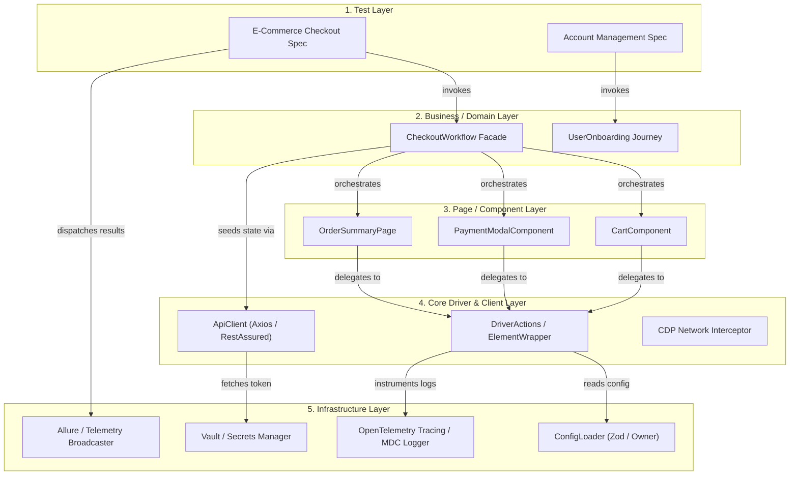

# SECTION 20 — TEST AUTOMATION ARCHITECTURE

## Executive Overview & Architectural North Star

An enterprise test automation framework is not merely a collection of scripts, test runners, and browser wrappers. It is a distributed, fault-tolerant, high-throughput software system engineered to provide continuous, deterministic quality telemetry at scale. 

When an automation suite scales beyond **5,000+ tests** executed across **100+ parallel workers** within enterprise CI/CD pipelines, naive scripting collapses under the weight of thread deadlocks, memory leaks, race conditions, test data collisions, and brittle network synchronization.

This guide provides the masterclass architectural blueprint for Principal SDETs and Senior Automation Architects. It dissects every tier of the automation ecosystem—from low-level OS process models and memory footprints to distributed sharding architectures and board-level release telemetry.

---

## 20.1 Layered Framework Architecture

### Architectural Mandate: The 5-Tier Unidirectional Hierarchy

To prevent monolithic spaghetti code, circular dependencies, and high maintenance costs, enterprise automation frameworks enforce a strict **5-Tier Downward-Only Layered Architecture**. Higher layers may call immediately lower layers; lower layers have zero knowledge of higher layers.

```
+-----------------------------------------------------------------------------------+
|                                 1. TEST LAYER                                     |
|   - Test Scenarios (@Test / test())            - Assertion Intent (expect / assertThat) |
|   - Test Data Binding (DataProviders/Fixtures)  - Test Metadata & Tags (@Epic, @Smoke)  |
+-----------------------------------------------------------------------------------+
                                         │  calls
                                         ▼
+-----------------------------------------------------------------------------------+
|                             2. BUSINESS / DOMAIN LAYER                            |
|   - Business Workflows & Journeys              - Persona Orchestration (Admin, User)  |
|   - Multi-Page / Cross-API Facades             - Domain Value Objects & DTOs           |
+-----------------------------------------------------------------------------------+
                                         │  calls
                                         ▼
+-----------------------------------------------------------------------------------+
|                        3. PAGE / SCREEN / COMPONENT LAYER                         |
|   - Atomic Component Objects (Modals, Tables)  - Page Objects (CheckoutPage)           |
|   - Scoped DOM Locators (No raw selectors out) - Semantic UI Actions (clickSubmit())   |
+-----------------------------------------------------------------------------------+
                                         │  calls
                                         ▼
+-----------------------------------------------------------------------------------+
|                         4. CORE DRIVER & CLIENT LAYER                             |
|   - Web/Mobile Driver Wrappers (SafeActions)   - REST / GraphQL Client Wrappers        |
|   - CDP / DevTools Protocol Interceptors       - Smart Synchronization & Polling Loops  |
+-----------------------------------------------------------------------------------+
                                         │  calls
                                         ▼
+-----------------------------------------------------------------------------------+
|                            5. INFRASTRUCTURE LAYER                                |
|   - Configuration Loader (.env, Vault, CLI)    - Distributed Tracing & Logging (OTel)  |
|   - Secret Management & Credential Scrubbing   - Container Orchestration (Testcontainers)|
|   - Reporting Engine & Webhook Telemetry       - File System & Cloud Artifact Storage  |
+-----------------------------------------------------------------------------------+
```



### Low-Level Mechanics & Responsibility Boundaries

1. **Test Layer**:
   - **Contract**: Contains *only* intent, business-level assertions, and metadata.
   - **Prohibited**: Zero raw locators (`By.xpath`, `page.locator('#btn')`), zero direct HTTP calls, zero thread management, zero wait primitives (`Thread.sleep`).
   - **Output**: Test results dispatched to listeners and reporting telemetry.

2. **Business / Domain Layer (Workflows & Facades)**:
   - **Contract**: Chains multi-step business interactions across multiple pages and services (e.g., `OrderFulfillmentWorkflow.fulfillOrder(orderId)`).
   - **Encapsulation**: Hides page-to-page navigation complexity from test scripts. Translates raw test parameters into domain entities (e.g., converting strings into `PaymentMethod` value objects).

3. **Page / Component Layer**:
   - **Contract**: Encapsulates DOM structure, component lifecycles, and atomic user interactions.
   - **Encapsulation**: Exposes methods named after human actions (`submitCredentials()`), returning either `void`, another component, or a read-only State DTO.
   - **Prohibited**: Hard assertions (`assert`, `expect`, `assertEquals`) must never reside here. If a Page asserts, it cannot be reused in negative testing or exploratory assertions.

4. **Core Driver & Client Layer**:
   - **Contract**: Direct wrapper around browser drivers (Selenium `WebDriver`, Playwright `Page`) and HTTP clients (`RestAssured`, `got`, `fetch`).
   - **Responsibilities**: Resilient click-and-type abstractions with auto-retries for `StaleElementReferenceException`, custom CDP listeners for network idling, and request/response logging.

5. **Infrastructure Layer**:
   - **Contract**: Cross-cutting foundation independent of any specific application feature.
   - **Responsibilities**: Environmental resolution (`QA`, `STAGING`, `PROD`), dynamic credential retrieval from HashiCorp Vault / AWS Secrets Manager, distributed tracing context, process cleanups, and report generation.

---

## 20.2 Separation of Concerns & Boundary Enforcement

### The Downward-Only Dependency Rule

The primary cause of architectural decay in enterprise test repositories is **dependency leak**:
- Tests directly calling WebDriver APIs bypassing Page Objects.
- Page Objects importing TestNG/JUnit assertion libraries.
- Core Driver classes importing specific domain Pages.

To ensure long-term architectural integrity across teams with 50+ contributing engineers, enforce boundary rules programmatically via automated linter AST rules and architecture tests.

### Boundary Enforcement in Java: ArchUnit

```java
package com.enterprise.architecture;

import com.tngtech.archunit.core.domain.JavaClasses;
import com.tngtech.archunit.core.importer.ClassFileImporter;
import com.tngtech.archunit.lang.ArchRule;
import org.testng.annotations.Test;

import static com.tngtech.archunit.lang.syntax.ArchRuleDefinition.classes;
import static com.tngtech.archunit.lang.syntax.ArchRuleDefinition.noClasses;

public class ArchitectureBoundaryTest {

    private final JavaClasses frameworkClasses = new ClassFileImporter()
            .importPackages("com.enterprise.automation");

    @Test(description = "Enforce downward-only layered dependencies")
    public void verifyLayeredArchitectureIntegrity() {
        // Rule 1: Page Objects must NEVER import assertion libraries (TestNG / AssertJ / JUnit)
        ArchRule pageObjectsNoAssertions = noClasses()
                .that().resideInAPackage("..pages..")
                .should().dependOnClassesThat()
                .resideInAnyPackage("org.testng.Assert..", "org.junit..", "org.assertj..");
        pageObjectsNoAssertions.check(frameworkClasses);

        // Rule 2: Tests must NEVER touch raw WebDriver instances directly
        ArchRule testsNoDirectDriver = noClasses()
                .that().resideInAPackage("..tests..")
                .should().dependOnClassesThat()
                .resideInAnyPackage("org.openqa.selenium.WebDriver", "org.openqa.selenium.WebElement");
        testsNoDirectDriver.check(frameworkClasses);

        // Rule 3: Core Driver layer must NEVER depend on Pages or Business workflows
        ArchRule coreDriverIndependent = noClasses()
                .that().resideInAPackage("..core.driver..")
                .should().dependOnClassesThat()
                .resideInAnyPackage("..pages..", "..workflows..", "..tests..");
        coreDriverIndependent.check(frameworkClasses);
    }
}
```

### Boundary Enforcement in TypeScript / Playwright: ESLint AST Rules

In TypeScript frameworks, configure `.eslintrc.js` with `eslint-plugin-import` and AST selectors to forbid raw selectors and locator definitions outside designated component directories:

```javascript
// .eslintrc.js
module.exports = {
  plugins: ['import'],
  rules: {
    // 1. Enforce strict downward-only import boundaries
    'import/no-restricted-paths': [
      'error',
      {
        zones: [
          // Tests cannot import Core Driver directly
          {
            target: './src/tests',
            from: './src/core/driver',
            message: 'Tests must interact through Business Workflows or Pages, never raw Driver primitives.',
          },
          // Pages cannot import test runners or assertions
          {
            target: './src/pages',
            from: '@playwright/test',
            importNames: ['expect', 'test'],
            message: 'Page objects must not import expect or test; keep assertions in the Test layer.',
          },
          // Core cannot depend on Pages or Business layers
          {
            target: './src/core',
            from: './src/pages',
            message: 'Core layer must be completely agnostic of domain pages.',
          },
        ],
      },
    ],
    // 2. Ban raw XPath and CSS string patterns inside test files
    'no-restricted-syntax': [
      'error',
      {
        selector: 'CallExpression[callee.property.name="locator"] > Literal[value=/^[\\.\\#\\/]/]',
        message: 'Raw CSS/XPath strings are banned in test specs. Encapsulate all selectors in Page/Component objects.',
      },
      {
        selector: 'CallExpression[callee.property.name="waitForTimeout"]',
        message: 'Explicit waitForTimeout (hard sleep) is strictly prohibited. Use web-first assertions or state polling.',
      },
    ],
  },
};
```

---

## 20.3 Page Object Model vs Component Object Model vs Screenplay Pattern

### Architectural Comparison Matrix

| Architectural Dimension | Page Object Model (POM) | Component Object Model (COM) | Screenplay Pattern |
| :--- | :--- | :--- | :--- |
| **Primary Abstraction Unit** | Entire Web Page / Screen | Autonomous, Reusable DOM Sub-tree | Actor performing Tasks & Questions |
| **Compositionality** | Poor (leads to 1,000+ line God classes) | Excellent (nested component trees) | Exceptional (highly composable granular tasks) |
| **SRP (Single Responsibility)** | Frequently violated | Enforced at component boundary | Strictly enforced (1 Task = 1 Responsibility) |
| **Code Duplication** | High across shared components (Headers/Nav) | Zero (component instantiated in pages) | Minimal (tasks reused across all journeys) |
| **Learning Curve** | Low / Universally understood | Moderate | High (requires deep OOP / Functional mindset) |
| **Maintenance Burden at Scale**| Unmanageable > 2,000 tests | Highly manageable | Lowest long-term maintenance |

### Component Object Model (COM) Implementation: Scoped Root Locators

In complex single-page applications (SPAs), an entire page is an assembly of components (Header, Navigation Drawer, Filter Sidebar, Data Grid, Pagination, Modal). In COM, every component accepts a **scoped root locator**. All child element queries execute strictly relative to that root.

```typescript
// src/components/base.component.ts
import { Locator, Page } from '@playwright/test';

export abstract class BaseComponent {
  protected constructor(
    protected readonly page: Page,
    protected readonly root: Locator
  ) {}

  public async isVisible(): Promise<boolean> {
    return this.root.isVisible();
  }
}

// src/components/data-table.component.ts
export class DataTableComponent<T> extends BaseComponent {
  private readonly rows: Locator;
  private readonly headers: Locator;
  private readonly nextButton: Locator;

  constructor(page: Page, root: Locator) {
    super(page, root);
    // Sub-locators are strictly scoped to the container root
    this.rows = this.root.locator('tbody tr');
    this.headers = this.root.locator('thead th');
    this.nextButton = this.root.locator('button[aria-label="Next Page"]');
  }

  public async getRowCount(): Promise<number> {
    return this.rows.count();
  }

  public async getRowData(rowIndex: number): Promise<string[]> {
    const row = this.rows.nth(rowIndex);
    return row.locator('td').allInnerTexts();
  }

  public async clickNextPage(): Promise<void> {
    await this.nextButton.click();
  }
}

// src/pages/inventory.page.ts
import { Page, Locator } from '@playwright/test';
import { DataTableComponent } from '../components/data-table.component';

export class InventoryPage {
  public readonly table: DataTableComponent<{ sku: string; price: number }>;
  private readonly pageTitle: Locator;

  constructor(private readonly page: Page) {
    this.pageTitle = page.getByRole('heading', { name: 'Inventory Management' });
    // Scoping the DataTableComponent to its specific DOM wrapper
    const tableContainer = page.locator('div.inventory-table-container');
    this.table = new DataTableComponent(page, tableContainer);
  }

  public async navigate(): Promise<void> {
    await this.page.goto('/admin/inventory');
  }
}
```

### Screenplay Pattern Implementation: Actors, Tasks, and Questions

The Screenplay Pattern models tests around **Actors** with **Abilities** who perform **Tasks** (composed interactions) and ask **Questions** (interrogating system state).

```typescript
// src/screenplay/core.ts
export interface Ability {}

export interface Task {
  performAs(actor: Actor): Promise<void>;
}

export interface Question<T> {
  answeredBy(actor: Actor): Promise<T>;
}

export class Actor {
  private abilities: Map<string, Ability> = new Map();

  constructor(public readonly name: string) {}

  public static named(name: string): Actor {
    return new Actor(name);
  }

  public whoCan(abilityName: string, ability: Ability): this {
    this.abilities.set(abilityName, ability);
    return this;
  }

  public using<T extends Ability>(abilityName: string): T {
    const ability = this.abilities.get(abilityName);
    if (!ability) throw new Error(`Actor ${this.name} lacks ability: ${abilityName}`);
    return ability as T;
  }

  public async attemptsTo(...tasks: Task[]): Promise<void> {
    for (const task of tasks) {
      await task.performAs(this);
    }
  }

  public async asks<T>(question: Question<T>): Promise<T> {
    return question.answeredBy(this);
  }
}
```

```typescript
// src/screenplay/abilities/browse-the-web.ts
import { Page } from '@playwright/test';
import { Ability } from '../core';

export class BrowseTheWeb implements Ability {
  constructor(public readonly page: Page) {}

  public static with(page: Page): BrowseTheWeb {
    return new BrowseTheWeb(page);
  }
}

// src/screenplay/tasks/checkout-items.ts
import { Actor, Task } from '../core';
import { BrowseTheWeb } from '../abilities/browse-the-web';

export class CheckoutItems implements Task {
  constructor(private readonly items: string[], private readonly promoCode?: string) {}

  public static withItems(items: string[]): CheckoutItems {
    return new CheckoutItems(items);
  }

  public andPromoCode(code: string): this {
    this.promoCode = code;
    return this;
  }

  public async performAs(actor: Actor): Promise<void> {
    const page = actor.using<BrowseTheWeb>('BrowseTheWeb').page;
    for (const item of this.items) {
      await page.locator(`button[data-sku="${item}"]`).click();
    }
    if (this.promoCode) {
      await page.locator('input#promo').fill(this.promoCode);
      await page.locator('button#apply-promo').click();
    }
    await page.locator('button#checkout-button').click();
  }
}

// src/screenplay/questions/order-confirmation.ts
import { Actor, Question } from '../core';
import { BrowseTheWeb } from '../abilities/browse-the-web';

export class OrderConfirmationTotal implements Question<number> {
  public static value(): OrderConfirmationTotal {
    return new OrderConfirmationTotal();
  }

  public async answeredBy(actor: Actor): Promise<number> {
    const page = actor.using<BrowseTheWeb>('BrowseTheWeb').page;
    const text = await page.locator('span.order-total').innerText();
    return parseFloat(text.replace(/[^0-9.-]+/g, ''));
  }
}
```

---

## 20.4 Service & API Client Layer Integration (Hybrid Testing Patterns)

### The Hybrid Testing Paradigm

Executing complete end-to-end user journeys strictly through the UI is the root cause of slow pipelines and high flakiness. 

**The Rule of Hybrid Automation**:
- **Preconditions / State Seeding**: Perform 100% via REST / GraphQL APIs or direct database writes (sub-second execution).
- **Execution / User Intent**: Perform via UI (testing the actual user experience).
- **Assertions / Postconditions**: Perform critical rendering checks on UI, then validate side-effects (database persistence, third-party webhook dispatch, Kafka messages) via direct service clients.

```
       TRADITIONAL (SLOW & BRITTLE)                   ENTERPRISE HYBRID (FAST & RESILIENT)
+------------------------------------------+  +-------------------------------------------------------+
| 1. UI: Navigate to /register (4.2s)      |  | 1. API: Seed User & Auth State via REST (120ms)       |
| 2. UI: Fill 12 Registration Inputs (3.8s)|  | 2. StorageState: Inject JWT/Cookies into Context(5ms) |
| 3. UI: Navigate to /login (2.1s)         |  | 3. UI: Navigate directly to /checkout (800ms)         |
| 4. UI: Fill Login Credentials (1.9s)     |  | 4. UI: Complete Checkout Interaction (1.2s)           |
| 5. UI: Search & Add 3 Items to Cart (8s) |  | 5. DB/API: Verify Order State & Inventory (60ms)     |
| 6. UI: Proceed to Checkout (3.5s)        |  +-------------------------------------------------------+
| 7. UI: Fill Payment & Submit (4.1s)      |           TOTAL TIME: ~2.2 SECONDS (12.5x FASTER)
+------------------------------------------+
         TOTAL TIME: ~27.6 SECONDS
```

### Production Resilient API Client with Retries & Interceptors

```typescript
// src/core/api/resilient-api-client.ts
import { APIRequestContext, APIResponse, request } from '@playwright/test';

export interface ApiClientConfig {
  baseUrl: string;
  authToken?: string;
  timeoutMs?: number;
  maxRetries?: number;
}

export class ResilientApiClient {
  private requestContext!: APIRequestContext;

  constructor(private readonly config: ApiClientConfig) {
    this.config.timeoutMs = config.timeoutMs ?? 10_000;
    this.config.maxRetries = config.maxRetries ?? 3;
  }

  public async init(): Promise<void> {
    this.requestContext = await request.newContext({
      baseURL: this.config.baseUrl,
      extraHTTPHeaders: {
        'Accept': 'application/json',
        'Content-Type': 'application/json',
        ...(this.config.authToken ? { Authorization: `Bearer ${this.config.authToken}` } : {}),
      },
      timeout: this.config.timeoutMs,
    });
  }

  public async post<T>(endpoint: string, payload: unknown): Promise<{ status: number; data: T }> {
    let attempts = 0;
    let lastError: Error | null = null;

    while (attempts < (this.config.maxRetries ?? 3)) {
      attempts++;
      try {
        const response: APIResponse = await this.requestContext.post(endpoint, {
          data: payload,
        });

        // Retry automatically on 502/503/504 transient server anomalies or 429 rate-limiting
        if ([429, 502, 503, 504].includes(response.status())) {
          const backoffTime = Math.pow(2, attempts) * 200 + Math.random() * 100;
          await new Promise((res) => setTimeout(res, backoffTime));
          continue;
        }

        if (!response.ok()) {
          const errorBody = await response.text();
          throw new Error(`HTTP Error ${response.status()} on ${endpoint}: ${errorBody}`);
        }

        const data = (await response.json()) as T;
        return { status: response.status(), data };
      } catch (err: any) {
        lastError = err;
        if (attempts >= (this.config.maxRetries ?? 3)) break;
      }
    }

    throw new Error(`Failed call to ${endpoint} after ${attempts} attempts. Cause: ${lastError?.message}`);
  }

  public async dispose(): Promise<void> {
    await this.requestContext.dispose();
  }
}
```

### Hybrid Spec: Fast Seeding & Browser State Injection

```typescript
// src/tests/checkout-hybrid.spec.ts
import { test, expect } from '@playwright/test';
import { ResilientApiClient } from '../core/api/resilient-api-client';
import { InventoryPage } from '../pages/inventory.page';

test.describe('E-Commerce Checkout Hybrid Suite', () => {
  let apiClient: ResilientApiClient;

  test.beforeAll(async () => {
    apiClient = new ResilientApiClient({
      baseUrl: process.env.API_BASE_URL || 'https://api.internal.enterprise.com',
      authToken: process.env.SERVICE_SVC_TOKEN,
    });
    await apiClient.init();
  });

  test.afterAll(async () => {
    await apiClient.dispose();
  });

  test('User completes order with API-pre-populated cart and storageState', async ({ browser }) => {
    // 1. FAST STATE SEEDING: Create user and inject cart items via API in ~150ms
    const userPayload = { email: `test_${Date.now()}@domain.com`, tier: 'GOLD' };
    const { data: user } = await apiClient.post<{ id: string; token: string }>('/v1/users', userPayload);
    
    await apiClient.post(`/v1/users/${user.id}/cart`, {
      items: [{ sku: 'SKU-ULTRA-9', quantity: 2 }],
    });

    // 2. INJECT AUTHENTICATION COOKIE / TOKEN DIRECTLY INTO BROWSER CONTEXT
    const context = await browser.newContext({
      extraHTTPHeaders: {
        'X-Correlation-ID': `TEST-${user.id}`,
      },
    });

    await context.addCookies([
      {
        name: 'AUTH_SESSION',
        value: user.token,
        domain: 'internal.enterprise.com',
        path: '/',
        httpOnly: true,
        secure: true,
        sameSite: 'Strict',
      },
    ]);

    const page = await context.newPage();

    // 3. JUMP DIRECTLY TO CHECKOUT (Zero login UI overhead)
    await page.goto('https://internal.enterprise.com/checkout');
    await expect(page.locator('span.cart-count')).toHaveText('2');

    // 4. PERFORM UI USER INTERACTION
    await page.getByRole('button', { name: 'Place Order' }).click();
    await expect(page.locator('.order-success-banner')).toBeVisible();

    // 5. ASYNC BACKEND VERIFICATION VIA API (Side-effect verification)
    const { data: orderStatus } = await apiClient.post<{ status: string }>(`/v1/orders/verify`, {
      userId: user.id,
    });
    expect(orderStatus.status).toBe('SETTLED');

    await context.close();
  });
});
```

---

## 20.5 Configuration & Secret Management Layer

### Configuration Precedence Model

Enterprise frameworks must resolve configuration through a strictly governed cascade:
1. **Runtime CLI Flags** (Highest priority: `-Denv=prod`, `--workers=16`)
2. **OS Environment Variables** (`process.env.STAGING_API_KEY`)
3. **Secret Stores** (HashiCorp Vault / AWS Secrets Manager)
4. **Environment-Specific Profiles** (`env.staging.json`, `application-qa.yml`)
5. **Base Defaults** (`default.json`, `framework.properties`)

```
 [ CLI Arguments: --env=staging --threads=8 ]
                     │  (overrides)
                     ▼
 [ OS Environment Variables: API_KEY, AWS_REGION ]
                     │  (overrides)
                     ▼
 [ Remote Secrets Store: HashiCorp Vault / AWS SM ]
                     │  (overrides)
                     ▼
 [ Environment Profile: config.staging.json ]
                     │  (overrides)
                     ▼
 [ Hard Defaults: default.config.ts ]
```

### Type-Safe Configuration Loader with Zod Validation

```typescript
// src/core/config/configuration.ts
import { z } from 'zod';
import * as dotenv from 'dotenv';
import * as path from 'path';

// 1. Define strict type schema with validation constraints
const EnvironmentSchema = z.enum(['local', 'dev', 'qa', 'staging', 'prod']);

const ConfigurationSchema = z.object({
  environment: EnvironmentSchema,
  baseUrl: z.string().url(),
  apiBaseUrl: z.string().url(),
  dbConnectionString: z.string().min(10),
  browser: z.enum(['chromium', 'firefox', 'webkit']).default('chromium'),
  headless: z.boolean().default(true),
  defaultTimeoutMs: z.number().int().positive().default(30_000),
  workerCount: z.number().int().min(1).max(64).default(4),
  vaultToken: z.string().optional(),
});

export type FrameworkConfig = z.infer<typeof ConfigurationSchema>;

export class ConfigManager {
  private static instance: FrameworkConfig;

  public static get(): FrameworkConfig {
    if (!ConfigManager.instance) {
      ConfigManager.instance = ConfigManager.resolveConfiguration();
    }
    return ConfigManager.instance;
  }

  private static resolveConfiguration(): FrameworkConfig {
    const env = (process.env.TEST_ENV || 'qa').toLowerCase();
    
    // Load base environment configuration file
    const envFilePath = path.resolve(__dirname, `../../../config/env.${env}.json`);
    dotenv.config({ path: path.resolve(__dirname, `../../../.env`) });

    let fileConfig = {};
    try {
      fileConfig = require(envFilePath);
    } catch {
      console.warn(`[WARN] Config file not found for env: ${envFilePath}. Falling back to OS vars.`);
    }

    const merged = {
      environment: env,
      baseUrl: process.env.BASE_URL ?? (fileConfig as any).baseUrl,
      apiBaseUrl: process.env.API_BASE_URL ?? (fileConfig as any).apiBaseUrl,
      dbConnectionString: process.env.DB_CONNECTION_STRING ?? (fileConfig as any).dbConnectionString,
      browser: process.env.BROWSER ?? (fileConfig as any).browser ?? 'chromium',
      headless: process.env.HEADLESS !== undefined ? process.env.HEADLESS === 'true' : true,
      defaultTimeoutMs: Number(process.env.TIMEOUT_MS ?? (fileConfig as any).defaultTimeoutMs ?? 30000),
      workerCount: Number(process.env.WORKER_COUNT ?? (fileConfig as any).workerCount ?? 4),
      vaultToken: process.env.VAULT_TOKEN,
    };

    // Validation ensures failure at frame boot, not in test step #45
    const parsed = ConfigurationSchema.safeParse(merged);
    if (!parsed.success) {
      console.error('Invalid framework configuration:', JSON.stringify(parsed.error.format(), null, 2));
      throw new Error('FATAL: Automation Framework Boot Aborted due to Configuration Violation.');
    }

    return parsed.data;
  }
}
```

### Zero-Trust In-Memory Credential Masking

Any framework logging HTTP requests, SQL queries, or Page interactions must sanitize strings using regex memory scrubbers to prevent leaking authorization headers, tokens, and credentials into CI logs or report artifacts:

```typescript
// src/core/logging/log-sanitizer.ts
export class LogSanitizer {
  private static readonly SENSITIVE_PATTERNS = [
    /(password["']?\s*[:=]\s*["'])([^"']+)(["'])/gi,
    /(bearer\s+)([a-zA-Z0-9_\-\.]+)/gi,
    /(api[_-]?key["']?\s*[:=]\s*["'])([^"']+)(["'])/gi,
    /(client[_-]?secret["']?\s*[:=]\s*["'])([^"']+)(["'])/gi,
  ];

  public static sanitize(message: string): string {
    let sanitized = message;
    for (const pattern of this.SENSITIVE_PATTERNS) {
      sanitized = sanitized.replace(pattern, '$1[REDACTED_SECRET]$3');
    }
    return sanitized;
  }
}
```

---

## 20.6 Test Data Management Strategy

### The 4 Data Tiers

```
+------------------------------------------------------------------------------------+
| 1. STATIC IMMUTABLE DATA                                                           |
|    - Zip codes, ISO currency codes, US State lists, fixed tax rates.               |
|    - Storage: JSON / CSV committed to repository. Safely shared across all threads.|
+------------------------------------------------------------------------------------+
| 2. DYNAMIC SYNTHETIC DATA                                                          |
|    - Random names, street addresses, credit card numbers, order memos.             |
|    - Generation: In-memory Faker / Bogus factories. Zero collisions.               |
+------------------------------------------------------------------------------------+
| 3. API-SEEDED TRANSACTIONAL ENTITIES                                               |
|    - Fresh User Account, Loaded Shopping Cart, KYC-Approved Loan Application.       |
|    - Lifespan: Created per-test via API/DB; targeted for soft/hard teardown.        |
+------------------------------------------------------------------------------------+
| 4. ISOLATED EPHEMERAL ENVIRONMENTS / DATABASES                                     |
|    - Dockerized Postgres / Kafka spins up via Testcontainers per runner pod.       |
|    - Lifespan: Exists only for the 15-minute test run; destroyed upon teardown.    |
+------------------------------------------------------------------------------------+
```

### Worker Isolation & Race Condition Prevention

When 100 workers execute concurrently, tests that reuse static usernames (`qa_automation_user@enterprise.com`) fail catastrophically due to DB unique constraints, dirty database states, and race conditions.

**Enterprise Isolation Formula**:
```
UniqueEntityIdentifier = Prefix + Environment + WorkerID + ExecutionTimestamp + NanoUUID
Example: "USR_QA_W04_1729002810_d9f8a2@enterprise.test"
```

### Fluent Data Builder Pattern with Auto-Teardown Registry

```typescript
// src/data/user-builder.ts
import { faker } from '@faker-js/faker';

export interface UserEntity {
  id?: string;
  email: string;
  firstName: string;
  lastName: string;
  role: 'ADMIN' | 'CUSTOMER' | 'AUDITOR';
  accountBalance: number;
}

export class UserBuilder {
  private user: UserEntity;

  constructor() {
    const workerId = process.env.TEST_WORKER_INDEX ?? '0';
    const timestamp = Date.now();
    const uniqueId = faker.string.alphanumeric(6);

    this.user = {
      email: `w${workerId}_${timestamp}_${uniqueId}@enterprise-test.internal`,
      firstName: faker.person.firstName(),
      lastName: faker.person.lastName(),
      role: 'CUSTOMER',
      accountBalance: 1000.0,
    };
  }

  public withRole(role: 'ADMIN' | 'CUSTOMER' | 'AUDITOR'): this {
    this.user.role = role;
    return this;
  }

  public withBalance(balance: number): this {
    this.user.accountBalance = balance;
    return this;
  }

  public build(): UserEntity {
    return { ...this.user };
  }
}
```

```typescript
// src/data/teardown-registry.ts
type TeardownHook = () => Promise<void>;

export class TeardownRegistry {
  private static hooks: TeardownHook[] = [];

  public static register(hook: TeardownHook): void {
    this.hooks.push(hook);
  }

  public static async executeAll(): Promise<void> {
    const errors: Error[] = [];
    while (this.hooks.length > 0) {
      const hook = this.hooks.pop();
      if (hook) {
        try {
          await hook();
        } catch (err: any) {
          errors.push(err);
        }
      }
    }
    if (errors.length > 0) {
      console.error(`Encountered ${errors.length} teardown errors:`, errors);
    }
  }
}
```

---

## 20.7 Driver & Browser Session Lifecycle Management

### Process Mechanics & Memory Leaks

Modern browsers spawn multi-process architectures:
- **Browser Main Process**: Coordinates UI, tabs, network dispatch, and plugin management.
- **Renderer Processes**: Sandbox rendering web content (V8 Engine + Blink/WebKit).
- **GPU Process**: Renders graphics layers.

#### The Zombie Process Disaster
In high-throughput Selenium or Puppeteer runs, improper shutdowns (`driver.close()` instead of `driver.quit()`) leave orphan `chrome.exe` / `chromedriver` processes running in memory. Over 5,000 tests, hundreds of orphan processes consume 100% of the RAM and CPU on CI nodes, causing subsequent tests to crash with `WebDriverException: Session timed out` or `Target Closed`.

#### Selenium ThreadLocal vs Playwright BrowserContext Isolation

```
SELENIUM THREADLOCAL MODEL                        PLAYWRIGHT BROWSERCONTEXT MODEL
+------------------------------------+             +-----------------------------------------+
| TestNG Thread Pool (e.g. 8 threads)|             | Single Browser Process (Chromium/WebKit)|
|  Thread 1 -> ThreadLocal<WebDriver>|             |  Context 1 (Test 1) -> Isolated Storage |
|  Thread 2 -> ThreadLocal<WebDriver>|             |  Context 2 (Test 2) -> Isolated Storage |
|  ...                               |             |  Context 3 (Test 3) -> Isolated Storage |
|  Each Thread spawns a FULL Chrome  |             | Light V8 sandboxes: 20ms startup vs 3s  |
|  Instance (Heavy RAM: ~350MB each) |             | Zero OS process leakage                 |
+------------------------------------+             +-----------------------------------------+
```

### Java / Selenium ThreadLocal Bulletproof Lifecycle

```java
package com.enterprise.core.driver;

import org.openqa.selenium.WebDriver;
import org.openqa.selenium.chrome.ChromeDriver;
import org.openqa.selenium.chrome.ChromeOptions;
import org.testng.IInvokedMethod;
import org.testng.IInvokedMethodListener;
import org.testng.ITestResult;

public class ThreadLocalDriverFactory implements IInvokedMethodListener {

    private static final ThreadLocal<WebDriver> DRIVER_THREAD_LOCAL = new ThreadLocal<>();

    public static WebDriver getDriver() {
        WebDriver driver = DRIVER_THREAD_LOCAL.get();
        if (driver == null) {
            throw new IllegalStateException("WebDriver not initialized for thread: " + Thread.currentThread().getName());
        }
        return driver;
    }

    @Override
    public void beforeInvocation(IInvokedMethod method, ITestResult testResult) {
        if (method.isTestMethod()) {
            ChromeOptions options = new ChromeOptions();
            options.addArguments("--headless=new", "--no-sandbox", "--disable-dev-shm-usage");
            WebDriver driver = new ChromeDriver(options);
            DRIVER_THREAD_LOCAL.set(driver);
        }
    }

    @Override
    public void afterInvocation(IInvokedMethod method, ITestResult testResult) {
        if (method.isTestMethod()) {
            WebDriver driver = DRIVER_THREAD_LOCAL.get();
            try {
                if (driver != null) {
                    driver.quit(); // Closes all windows and terminates the chromedriver binary process
                }
            } catch (Exception ex) {
                System.err.println("Error quitting driver for thread " + Thread.currentThread().getName() + ": " + ex.getMessage());
            } finally {
                // CRITICAL: Prevent memory leaks inside Java ThreadPool ThreadLocalMap
                DRIVER_THREAD_LOCAL.remove();
            }
        }
    }
}
```

### Playwright Custom Context Fixture with Trace Harvesting

```typescript
// src/fixtures/test-fixtures.ts
import { test as base, Page, BrowserContext } from '@playwright/test';
import * as fs from 'fs';
import * as path from 'path';

type TestFixtures = {
  isolatedPage: Page;
};

export const test = base.extend<TestFixtures>({
  isolatedPage: async ({ browser }, use, testInfo) => {
    // 1. Create fully isolated browser context
    const context: BrowserContext = await browser.newContext({
      viewport: { width: 1920, height: 1080 },
      recordVideo: testInfo.retry > 0 ? { dir: 'test-results/videos/' } : undefined,
    });

    // 2. Start tracing on retry or for critical paths
    await context.tracing.start({ screenshots: true, snapshots: true, sources: true });

    const page: Page = await context.newPage();

    // 3. Hand control to the test spec
    await use(page);

    // 4. Post-test execution: Save traces only upon failure
    if (testInfo.status !== testInfo.expectedStatus) {
      const tracePath = path.resolve(`test-results/traces/${testInfo.title.replace(/\s+/g, '_')}_failed.zip`);
      await context.tracing.stop({ path: tracePath });
      await testInfo.attach('failure-trace', { path: tracePath, contentType: 'application/zip' });
    } else {
      await context.tracing.stop();
    }

    // 5. Guaranteed cleanup: Closes context and drops all cookies/cache without lingering handles
    await context.close();
  },
});

export { expect } from '@playwright/test';
```

---

## 20.8 Dependency Management & Build Systems

### Diamond Dependency Resolution

In large enterprise automation codebases, transitive dependencies often collide:
- Selenium 4.x pulls in a newer version of `Guava` or `Netty`.
- RestAssured pulls in an older version of `Jackson` or `Groovy`.
- Result: Runtime `NoSuchMethodError`, `ClassNotFoundException`, or `IncompatibleClassChangeError`.

```
          Automation Suite (pom.xml)
                │              │
                ▼              ▼
        Selenium 4.25       RestAssured 5.4
                │              │
                ▼              ▼
          Guava 33.3-jre   Guava 28.0-android  <--- DIAMOND COLLISION!
```

### Solution: Gradle Version Catalogs and Maven BOMs

#### Gradle Version Catalog (`gradle/libs.versions.toml`)
```toml
[versions]
selenium = "4.25.0"
testng = "7.10.2"
rest-assured = "5.5.0"
jackson = "2.17.2"
slf4j = "2.0.16"

[libraries]
selenium-java = { module = "org.seleniumhq.selenium:selenium-java", version.ref = "selenium" }
testng = { module = "org.testng:testng", version.ref = "testng" }
rest-assured = { module = "io.rest-assured:rest-assured", version.ref = "rest-assured" }
jackson-databind = { module = "com.fasterxml.jackson.core:jackson-databind", version.ref = "jackson" }
slf4j-api = { module = "org.slf4j:slf4j-api", version.ref = "slf4j" }

[bundles]
testing-stack = ["selenium-java", "testng", "rest-assured", "jackson-databind"]
```

#### Maven BOM Bill of Materials (`pom.xml`)
```xml
<dependencyManagement>
    <dependencies>
        <!-- Import Jackson BOM to align all JSON modules -->
        <dependency>
            <groupId>com.fasterxml.jackson</groupId>
            <artifactId>jackson-bom</artifactId>
            <version>2.17.2</version>
            <type>pom</type>
            <scope>import</scope>
        </dependency>
    </dependencies>
</dependencyManagement>
```

### Deterministic Builds in TypeScript / Node

Using caret (`^`) or tilde (`~`) in `package.json` guarantees that your pipeline will eventually fail when a downstream sub-dependency publishes a breaking minor or patch release.

**Production Standards**:
1. Exact package version pinning in `package.json` (no `^` or `~`).
2. Commit `package-lock.json` or `pnpm-lock.yaml` to source control.
3. In CI, **always** install via `npm ci --frozen-lockfile` or `pnpm install --frozen-lockfile`. Never run `npm install` in CI.

```json
{
  "name": "enterprise-e2e-framework",
  "version": "4.2.0",
  "private": true,
  "engines": {
    "node": ">=20.14.0",
    "npm": ">=10.7.0"
  },
  "scripts": {
    "test:ci": "playwright test --reporter=blob"
  },
  "dependencies": {
    "@playwright/test": "1.48.0",
    "@faker-js/faker": "9.0.3",
    "dotenv": "16.4.5",
    "winston": "3.15.0",
    "zod": "3.23.8"
  }
}
```

---

## 20.9 Logging & Distributed Tracing

### Structured JSON Logging vs Freeform Text

Freeform text logs (`System.out.println("Clicked button")`) cannot be indexed, queried, or aggregated across 100 parallel pods running 5,000 tests.

Enterprise logging produces **Machine-Readable Structured JSON** containing execution metadata: `testId`, `testName`, `workerIndex`, `threadId`, `correlationId`, `durationMs`, and `errorStack`.

```json
{
  "timestamp": "2026-10-07T05:30:12.451Z",
  "level": "INFO",
  "logger": "com.enterprise.driver.SafeActions",
  "thread": "TestNG-test=Regression-3",
  "context": {
    "testCaseId": "TC-8492",
    "testName": "verifyCheckoutFlow",
    "workerId": "worker-03",
    "correlationId": "CORR-9d8a-4b01-bc8e"
  },
  "message": "Element clicked successfully",
  "target": "button[name='checkout']",
  "elapsedMs": 42
}
```

### OpenTelemetry (OTel) Distributed Tracing Integration

When an automated test triggers an action, distributed tracing propagates a **W3C `traceparent`** HTTP header across all downstream microservices:

```
[ Automated Test Runner ] (Creates Root Trace: 4bf92f3577b34da6a3ce929d0e0e4736)
          │
          │ HTTP POST /orders (Header: traceparent: 00-4bf92f3577b34da6a3ce929d0e0e4736-00f067aa0ba902b7-01)
          ▼
   [ API Gateway ]
          │
          ▼
   [ Order Service ] ──> [ Payment Service ] ──> [ Kafka Topic ]
```

When a test fails with a 500 error or UI timeout, engineers use the `traceparent` from the test report to inspect the exact trace in Datadog/Jaeger and identify the failing backend service within seconds.

### Java Logback Structured Configuration (`logback.xml`)

```xml
<configuration scan="true" scanPeriod="30 seconds">
    <appender name="STDOUT" class="ch.qos.logback.core.ConsoleAppender">
        <encoder class="net.logstash.logback.encoder.LogstashEncoder">
            <includeMdcKeyName>testCaseId</includeMdcKeyName>
            <includeMdcKeyName>correlationId</includeMdcKeyName>
            <includeMdcKeyName>workerId</includeMdcKeyName>
            <fieldNames>
                <timestamp>timestamp</timestamp>
                <level>severity</level>
                <thread>threadName</thread>
            </fieldNames>
        </encoder>
    </appender>

    <root level="INFO">
        <appender-ref ref="STDOUT" />
    </root>
</configuration>
```

---

## 20.10 Reporting & Release Telemetry

### Reporting Architecture: Local vs Executive vs Release Telemetry

A mature framework serves three distinct audiences:
1. **Engineers (Local / PR Level)**: Instant diagnostics via Playwright Trace Viewer, inline screenshots, and console logs.
2. **QA / Engineering Managers (Suite Level)**: Allure Reports showing historical pass rates, defect categorization (Product Bug vs Automation Flake), and step timelines.
3. **Engineering Leadership / DevOps (Release Level)**: DORA Quality Telemetry ingested into Datadog, BigQuery, or Grafana dashboards.

```
+-----------------------------------------------------------------------------------+
|                            ENTERPRISE TELEMETRY PIPELINE                          |
+-----------------------------------------------------------------------------------+
           │
           ├──> Allure Results (XML/JSON) ──> Allure Server (Historical Trends)
           │
           ├──> Playwright Blob Reports ──> Merged HTML Report (Stored in S3)
           │
           ├──> Webhook Broadcaster ──> Slack / Microsoft Teams Alerting
           │
           └──> Telemetry Event Emitter ──> Kafka / Datadog (DORA Metrics Engine)
```

### Production Adaptive Webhook Notification Broadcaster

```typescript
// src/reporters/slack-telemetry-reporter.ts
import { Reporter, FullResult, TestCase, TestResult } from '@playwright/test/reporter';
import axios from 'axios';

export default class SlackTelemetryReporter implements Reporter {
  private totalTests = 0;
  private passedTests = 0;
  private failedTests = 0;
  private flakyTests = 0;
  private failedSummaries: string[] = [];

  onTestEnd(test: TestCase, result: TestResult): void {
    this.totalTests++;
    if (result.status === 'passed') {
      if (result.retry > 0) this.flakyTests++;
      else this.passedTests++;
    } else if (result.status === 'failed' || result.status === 'timedOut') {
      this.failedTests++;
      this.failedSummaries.push(`• *${test.title}* (${result.error?.message?.slice(0, 100) ?? 'Unknown error'})`);
    }
  }

  async onEnd(result: FullResult): Promise<void> {
    const webhookUrl = process.env.SLACK_RELEASE_WEBHOOK_URL;
    if (!webhookUrl) return;

    const passRate = ((this.passedTests / this.totalTests) * 100).toFixed(1);
    const isSuccess = this.failedTests === 0;

    const payload = {
      text: isSuccess ? `✅ CI Test Run PASSED (${passRate}%)` : `🚨 CI Test Run FAILED (${this.failedTests} Failures)`,
      attachments: [
        {
          color: isSuccess ? '#36a64f' : '#dc3545',
          fields: [
            { title: 'Environment', value: process.env.TEST_ENV || 'QA', short: true },
            { title: 'Duration', value: `${(result.duration / 1000 / 60).toFixed(2)} min`, short: true },
            { title: 'Total / Passed', value: `${this.totalTests} / ${this.passedTests}`, short: true },
            { title: 'Failed / Flaky', value: `${this.failedTests} / ${this.flakyTests}`, short: true },
          ],
          text: this.failedSummaries.length > 0
            ? `*Top Failures:*\n${this.failedSummaries.slice(0, 5).join('\n')}\n...and ${Math.max(0, this.failedSummaries.length - 5)} more.`
            : 'All tests passed cleanly.',
          footer: `Git Commit: ${process.env.GIT_COMMIT_SHA?.slice(0, 8)} | Run ID: ${process.env.CI_RUN_ID}`,
        },
      ],
    };

    try {
      await axios.post(webhookUrl, payload, { timeout: 5000 });
    } catch (err: any) {
      console.error('Failed to dispatch Slack release notification:', err.message);
    }
  }
}
```

---

## 20.11 Scalability & Sharding Architecture (Running 5,000+ Tests Under 15 Minutes)

### Mathematical Formulation of High-Throughput Execution

Assume an enterprise suite of **5,000 tests**:
- Average test duration: **25 seconds** (hybrid execution).
- Total sequential execution time:
  $$\text{Total Time} = 5,000 \times 25\text{s} = 125,000\text{ seconds } (\approx 34.72\text{ hours})$$
- Target pipeline wall-clock budget: **12 minutes** ($720\text{ seconds}$), leaving 3 minutes for runner spin-up and report aggregation.

**Formula for Required Concurrent Slots ($W$):**
$$W_{\text{raw}} = \left\lceil \frac{\text{Total Sequential Time}}{\text{Target Wall Time}} \right\rceil = \left\lceil \frac{125,000}{720} \right\rceil = 174\text{ concurrent workers}$$

Accounting for a **12% buffer** for network variance, test retry overhead, and cold container starts:
$$W_{\text{target}} = \lceil 174 \times 1.12 \rceil = \mathbf{195\text{ parallel workers}}$$

### Architecture: Distributed Kubernetes Pod Sharding

Rather than running 195 threads on one massive virtual machine (which causes severe socket and CPU thrashing), distribute tests across **39 Kubernetes runner pods** with **5 workers each**:

```
                       CI/CD Trigger (GitHub Actions / GitLab CI)
                                         │
                 ┌───────────────────────┴───────────────────────┐
                 ▼                                               ▼
     Matrix Shard 1 / 39                             Matrix Shard 39 / 39
  (Pod: 4 vCPU, 8GB RAM)                          (Pod: 4 vCPU, 8GB RAM)
  Workers: 5 Processes                            Workers: 5 Processes
  Tests: ~128 Specs                               Tests: ~128 Specs
         │                                               │
         ▼                                               ▼
  Blob Report 1                                   Blob Report 39
  (upload to S3)                                  (upload to S3)
                 │                                               │
                 └───────────────────────┬───────────────────────┘
                                         ▼
                            Reporting Aggregation Job
                  1. Download 39 Blob Reports from S3 (20s)
                  2. npx playwright merge-reports (15s)
                  3. Publish Unified HTML Report to Cloudflare Pages
                  4. Emit Pass/Fail Gate to PR Pipeline
```

### GitHub Actions Sharded Workflow Configuration

```yaml
name: Enterprise Scaled Regression Suite

on:
  push:
    branches: [main]
  workflow_dispatch:

jobs:
  run-sharded-tests:
    runs-on: ubuntu-latest
    strategy:
      fail-fast: false
      matrix:
        shardIndex: [1, 2, 3, 4, 5, 6, 7, 8, 9, 10, 11, 12, 13, 14, 15, 16, 17, 18, 19, 20]
        totalShards: [20]
    container:
      image: mcr.microsoft.com/playwright:v1.48.0-jammy
      options: --ipc=host # CRITICAL: Prevents Chromium /dev/shm shared memory exhaustion

    steps:
      - name: Checkout Code
        uses: actions/checkout@v4

      - name: Setup Node.js Runtime
        uses: actions/setup-node@v4
        with:
          node-version: 20
          cache: 'npm'

      - name: Install Pinned Dependencies
        run: npm ci --frozen-lockfile

      - name: Execute Sharded Suite
        env:
          TEST_ENV: staging
          VAULT_TOKEN: ${{ secrets.VAULT_TOKEN }}
          WORKER_COUNT: 4
        run: |
          npx playwright test \
            --shard=${{ matrix.shardIndex }}/${{ matrix.totalShards }} \
            --workers=4 \
            --reporter=blob

      - name: Upload Shard Blob Artifact
        if: always()
        uses: actions/upload-artifact@v4
        with:
          name: blob-reports-shard-${{ matrix.shardIndex }}
          path: blob-report
          retention-days: 1

  merge-and-publish-reports:
    needs: [run-sharded-tests]
    if: always()
    runs-on: ubuntu-latest
    steps:
      - name: Checkout Code
        uses: actions/checkout@v4

      - name: Setup Node.js Runtime
        uses: actions/setup-node@v4
        with:
          node-version: 20

      - name: Install Dependencies
        run: npm ci --frozen-lockfile

      - name: Download All Shard Artifacts
        uses: actions/download-artifact@v4
        with:
          path: all-blob-reports
          pattern: blob-reports-shard-*
          merge-multiple: true

      - name: Merge Blob Reports into Unified Report
        run: |
          npx playwright merge-reports --reporter=html ./all-blob-reports

      - name: Deploy Unified Report to Cloud Storage
        run: |
          echo "Deploying unified report to internal S3 / Cloudflare Pages..."
          # aws s3 sync playwright-report s3://enterprise-qa-reports/${{ github.run_id }}
```

---

## 20.12 High-Stakes Senior Framework Architecture Interview Questions & Whiteboard Scripts

### Question 1: "Design an enterprise test framework from scratch for an e-commerce platform processing 10,000 orders/minute across web, mobile, and 50 microservices."

#### Senior Architect Verbal Response
> "To support an e-commerce system processing 10,000 orders/minute across web, mobile, and 50 microservices, the framework must be designed around **domain decoupling, contract-first integration, and hybrid execution**.
> 
> First, for architecture, I enforce a strict 5-layer downward-only model: Test Layer $\rightarrow$ Domain Workflows $\rightarrow$ Components $\rightarrow$ Core Driver/Client $\rightarrow$ Infrastructure. I ban direct driver calls and raw locators in tests using ArchUnit in Java or ESLint AST rules in TypeScript.
> 
> Second, to keep pipeline runs fast and avoid flaky UI tests, we implement **Hybrid Testing**:
> - Preconditions (creating users, inventory allocation, cart population) are handled via typed REST/GraphQL clients using ephemeral service tokens in under 200ms.
> - The UI layer is reserved strictly for validating critical user flows—such as payment form interactions and complex DOM rendering.
> - Session cookies and JWTs are injected directly into browser contexts (`storageState`), bypassing the login UI on every test.
> 
> Third, for multi-platform support across web and mobile, I build a unified Business Workflow layer. The workflow `CheckoutOrder(cart)` delegates to platform-specific drivers (Playwright for Web, Appium for Mobile) via an abstract interface:
> 
> ```
>               [ CheckoutOrder Workflow ]
>                           │
>            ┌──────────────┴──────────────┐
>            ▼                             ▼
>   [ WebCheckoutComponent ]     [ MobileCheckoutScreen ]
>   (Playwright Locators)        (Appium AccessibilityIDs)
> ```
> 
> Finally, for scalability across 50 microservices, we validate service contracts using Pact at the API boundary, while E2E tests inject OpenTelemetry `traceparent` headers into browser sessions. If an end-to-end checkout flow fails in staging, the trace ID in the test report links directly to backend spans in Datadog, pinpointing whether the Payment Service or Inventory Service threw the exception."

---

### Question 2: "How do you guarantee test determinism and eliminate all race conditions in a 100-parallel-worker execution grid?"

#### Senior Architect Verbal Response
> "Test nondeterminism in high-concurrency environments stems from three root causes: **shared mutable data**, **state leakage across browser contexts**, and **asynchronous DOM timing issues**.
> 
> Here is my strategy to achieve 100% determinism:
> 
> 1. **Zero Shared Mutable State (Hermetic Test Isolation)**:
>    - Banning static test users (such as `test_user_qa`). Every worker generates isolated synthetic users prefixed with its Worker ID, process timestamp, and a UUID:
>    $$\text{Username} = \text{"USR\_W" } + \text{workerId} + \text{"\_" } + \text{timestamp} + \text{"\_" } + \text{uuid}$$
>    - Every test provisions its own state via direct API calls during test setup and registers cleanup routines with a `TeardownRegistry`.
> 
> 2. **OS and Context Isolation**:
>    - In Playwright, each worker runs in its own OS process with a dedicated `BrowserContext`, providing sandboxed cookies, localStorage, and cache.
>    - In Selenium, we use `ThreadLocal<WebDriver>` with an `IInvokedMethodListener`. We call `driver.quit()` and `THREAD_LOCAL.remove()` in `finally` blocks to prevent thread reuse leaks.
>    - On Linux CI containers, we mount `--ipc=host` to prevent `/dev/shm` shared memory crashes under heavy parallel load.
> 
> 3. **Eliminating Polling Race Conditions**:
>    - We ban hardcoded sleeps (`Thread.sleep()`, `waitForTimeout()`) using AST lint checks.
>    - We rely exclusively on web-first assertions that poll the DOM with auto-retry mechanisms, and we use CDP listeners (`waitForLoadState('networkidle')`) to verify that background fetch requests settle before triggering downstream actions."

---

### Question 3: "Why would you choose or reject BDD/Cucumber for an enterprise automation suite, and how do you handle executive pressure to implement it?"

#### Senior Architect Verbal Response
> "I generally **reject Cucumber/BDD** for technical automation suites at enterprise scale, and here is my architectural reasoning:
> 
> 1. **The Translation Tax**:
>    Gherkin adds a maintenance layer: Gherkin Feature File $\rightarrow$ Regex Step Definitions $\rightarrow$ Page Objects $\rightarrow$ Driver Actions. This increases code surface area and refactoring overhead without improving test quality.
> 
> 2. **The Illusion of Business Collaboration**:
>    In practice, Product Managers and Business Analysts rarely write or maintain `.feature` files long-term. SDETs end up writing Gherkin for other engineers, creating unnecessary regex overhead.
> 
> 3. **Code Quality and Parallel Scaling**:
>    Gherkin step definitions encourage shared global state (such as passing scenario state across steps using DI containers like PicoContainer). In suites with 100+ parallel workers, this often leads to state leakage and flaky runs.
> 
> **How I Handle Executive Pressure**:
> When leadership requests BDD because they want 'readable living documentation,' I address the underlying requirement without the Cucumber overhead:
> 
> - I demonstrate **Allure Framework** or **Playwright HTML Reports** using `@Step` annotations, nested test steps (`test.step('Verify Payment Modal', ...)`), and human-readable reporting DSLs.
> - I provide a cost-benefit analysis comparing maintenance costs: a pure Screenplay or COM framework with Allure step logging delivers clean, business-readable reports with roughly 40% less boilerplate code and zero regex-binding overhead."

---

### Question 4: "Explain how you architect secrets management, zero-trust authentication, and dynamic ephemeral environments in CI/CD."

#### Senior Architect Verbal Response
> "Our secrets management follows a zero-trust model: **Zero secrets stored in code repositories, zero long-lived static credentials, and automated log scrubbing**.
> 
> 1. **Secret Resolution Pipeline**:
>    - During CI boot, runner pods authenticate with HashiCorp Vault or AWS Secrets Manager using ephemeral OIDC tokens provided by the CI system (GitHub Actions / GitLab CI).
>    - The test runner fetches short-lived environment tokens directly into memory. Secrets are never written to disk or `.env` files.
>    - Static analysis scanning (TruffleHog, GitGuardian) runs in pre-commit hooks and PR gates to block committed API keys or tokens.
> 
> 2. **In-Memory Scrubbing**:
>    - Custom interceptors wrap logging frameworks (Logback, Winston) to scrub authorization headers, Bearer tokens, and passwords using regex patterns before logs are written to stdout or remote sinks.
> 
> 3. **Dynamic Ephemeral Environments**:
>    - For pull request verification, we deploy containerized preview environments using Helm, ArgoCD, or AWS ECS.
>    - The CI pipeline boots ephemeral database containers using Testcontainers or provisions clean database schemas:
>    ```bash
>    CREATE SCHEMA test_runner_pr_482;
>    # Run Liquibase / Flyway migrations -> Execute Tests -> Drop Schema
>    ```
>    - This approach provides complete environment isolation without running into cross-PR database locks or dirty state."

---

### Question 5: "Your test suite takes 3 hours to run in CI and fails 15% of the time due to flakes. Detail your 30-60-90 day architectural turnaround roadmap."

#### Senior Architect Verbal Response
> "A 3-hour runtime with a 15% flake rate means the test suite has lost team trust and is blocking releases. Here is my structured 30-60-90 day turnaround plan:

```
+------------------------------------------------------------------------------------+
| 30 DAYS: TRIAGE, QUARANTINE & STABILIZE                                            |
| - Implement automated Flake Quarantine: Flag tests failing on retries and route   |
|   them to a non-blocking diagnostic suite. PR pipeline becomes green and trusted.  |
| - Ban explicit sleeps (Thread.sleep) via AST lint rules; replace with dynamic waits.|
| - Remove shared static test accounts; implement worker-isolated UUID data.         |
+------------------------------------------------------------------------------------+
| 60 DAYS: HYBRID ARCHITECTURE & CONTAINERIZATION                                    |
| - Convert slow UI setups (registration, cart setup) into direct REST API calls,    |
|   cutting average test runtime by 50-70%.                                          |
| - Introduce BrowserContext-level authentication injection (storageState).          |
| - Standardize runner environments using Docker to eliminate OS-level differences.  |
+------------------------------------------------------------------------------------+
| 90 DAYS: MATRIX SHARDING & DORA TELEMETRY                                          |
| - Implement 20-30x matrix sharding in CI using Kubernetes and blob merge reports,   |
|   bringing total pipeline runtime down from 3 hours to under 15 minutes.           |
| - Integrate Allure / Datadog dashboards to track Flake Rate and P95 runtimes.      |
| - Establish SLA gates: Any test with a flake rate > 2% over 7 days is auto-demoted |
|   to the diagnostic suite until addressed by its owning team.                       |
+------------------------------------------------------------------------------------+
```

> **Target Outcomes by Day 90**:
> - Execution runtime reduced from **180 minutes to under 12 minutes**.
> - Suite pass rate increased from **85% to 99.2%+**.
> - The automation pipeline transitions from a deployment bottleneck into a reliable CI quality gate."
